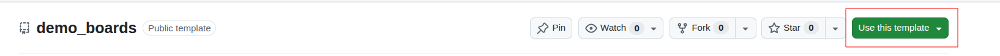

# ESP Board Manager Vendor Board Pack Guide

[中文](VENDOR_GUIDE_CN.md)

Use this guide to create a vendor board-pack repository from this GitHub
template, adapt boards, and configure CI. Maintain the public component
description in [README.md](README.md).

## 1. Create and Configure the Repository

1. Open the [template repository](https://github.com/LiuCodee/boards-template)
   on GitHub and select **Use this template** → **Create a new repository**.

   

2. Choose the personal GitHub account or company organization that will own the
   repository, name it, and choose **Public**.
3. Clone the new repository into your local environment:

   ```bash
   git clone git@github.com:YOUR_NAMESPACE/REPOSITORY_NAME.git
   cd REPOSITORY_NAME
   ```

4. Run `python scripts/initialize_board_pack.py`. The script asks in Chinese
   and English for the vendor name, namespace, component name, description,
   and copyright holder. Press Enter to accept a default value; the script
   updates the README files, `idf_component.yml`, `LICENSE`, and CI.
5. Sign in to [ESP Component Registry](https://components.espressif.com) with
   your GitHub account and create an API token with the `write:components`
   scope.
6. In your GitHub repository, open **Settings** → **Secrets and variables** →
   **Actions** → **New repository secret**. Create the
   `IDF_COMPONENT_API_TOKEN` secret and set it to the token value.

## 2. Adapt and Publish the Board

1. Prepare the board materials: schematics, hardware feature descriptions, and
   board initialization code from existing projects, if available.

2. Configure [ESP Pilot MCP](https://mcp.espressif.com/#esp-pilot-mcp) in your
   AI tool, then provide those materials to the AI to help create or migrate
   board configurations.

   - If its introduction page is unavailable, give the AI assistant this direct
     URL: `https://mcp.esp-pilot.espressif.com/mcp`.
   - To create or adjust configurations manually, refer to the
     [Create a Board Guide](https://docs.espressif.com/projects/esp-board-manager/en/latest/create-board/index.html)
     and choose the appropriate method.

3. After adding boards, run `python scripts/update_supported_boards_table.py`
   to update the board tables in both README files. The script does not modify
   existing table content; it only appends the board name and chip for new
   boards at the end of the table.

4. Submit board changes through a pull request. CI generates and builds every
   supported board combination across the declared Board Manager lower bound,
   the latest version, ESP-IDF `v5.5.4`, and `latest`.

Before production publishing, check that:

- `example_board/` has been removed and real boards have been added.
- Both README files list the vendor, component description, and supported boards.
- Every CI matrix entry has passed.

When the checks pass, remove `--dry-run` from the upload command in
`.github/workflows/ci.yml`, then merge to `main` or push a `v*` tag to publish
the new version.

## Notes

### Component Namespace

The first sign-in to ESP Component Registry with a GitHub account automatically
creates a default namespace matching that GitHub username. No separate request
is needed:

```text
GitHub: user/demo_boards  →  Registry: user/demo_boards
```

To use a company name or another specified namespace, open the account menu in
ESP Component Registry and request it under **Permissions** → **Namespace
Requests**. After approval, create the API token with an account that has
permission to publish to that namespace.

### Repository and Board Directories

- Use a public repository name containing `boards`, with only lowercase letters,
  numbers, and underscores, for example `acme_boards`.
- Board directories can be nested up to three levels below the repository root.
  CI discovers and tests every board within this range:

  ```text
  example_board/
  audio/esp32_s3_speaker/
  display/round/esp32_p4_screen/
  ```

- Each board directory name must match the `board` field in its
  `board_info.yaml`. Directories at the fourth level or deeper are not
  discovered.
- Retain the `esp_board_manager`, `board_manager`, and `boards` values in
  `idf_component.yml`'s `tags` list so board-pack components can be discovered
  automatically. You may add tags, but do not remove these three.

### License

This template uses Apache-2.0. For new content, replace `CHANGE_ME` in
`LICENSE` with the copyright holder, normally the legal company name. Preserve
and comply with existing notices and licenses when adding third-party content.

### Release Version

The component version must follow the [ESP-IDF Component Manager versioning
scheme](https://docs.espressif.com/projects/idf-component-manager/en/latest/reference/versioning.html).
The upload job in `.github/workflows/ci.yml` uses
`compote component upload --dry-run` by default to validate authentication and
packaging without creating a public registry version. `--allow-existing`
prevents the workflow from overwriting an existing version.

The initialization script keeps `${{ github.repository_owner }}` in the upload
command by default. It replaces that argument with a fixed namespace only when
the entered namespace differs from the repository owner.
